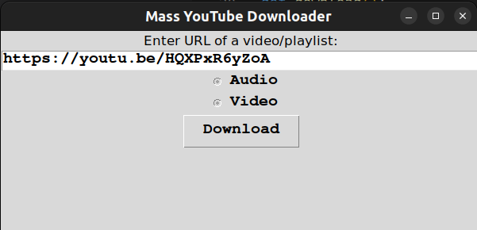

# Mass Youtube Downloader
With **Mass Youtube Downloader**, you can:
- Download video/audio from YouTube from a User Interface
- **Mass** download from a playlist
- Filter your download by durations of the videos (in development)

## Getting started
### Install These Required Packages: 
- [download_dl](http://ytdl-org.github.io/youtube-dl/download.html) (their [GitHub repo](https://github.com/ytdl-org/youtube-dl))
- ffmpeg

### Install required packages for Window
- Open "Power Shell" app as Admin
- Install Choco package manager/installer: `Set-ExecutionPolicy Bypass -Scope Process -Force; [System.Net.ServicePointManager]::SecurityProtocol = [System.Net.ServicePointManager]::SecurityProtocol -bor 3072; iex ((New-Object System.Net.WebClient).DownloadString('https://community.chocolatey.org/install.ps1'))`
- Install 2 required packages: `choco install ffmpeg youtube-dl`

### Run the app

1. Download the app
    ```bash
    git clone https://github.com/rodonguyen/mass-youtube-downloader 
    cd mass-youtube-downloader
    ```

2. In the app directory, enter this command  to run the app:  
    ```
    python3 app.py
    ```
    Or using the pre-build
    ```bash
    ./dist/app
    ```

3. The app should appear on your screen:
  

1. Paste the link of the video you want to download
1. Choose either audio/video
1. Click Download. This will create a thread and start downloading. You can view the progress in the command. You can also download another file if you wish to and all your downloadings will run synchronously.


## Further development
- Migrate to PyQt5
- Option to ignore files whose sizes are out of allowed range
- Option to choose downloading format, resolution, audio quality


<br>


## Troubleshoot


[GitHub comment](https://github.com/ytdl-org/youtube-dl/issues/31530#issuecomment-1435477247): You may need to add `--force-reinstall` since pip can't tell that this is a new version. For instance, @paulrougieux recommends this:

```
pip install --upgrade --force-reinstall "git+https://github.com/ytdl-org/youtube-dl.git"
```

In any pip commands it's recommended to use `python3 -m pip` instead of just pip, where python is the name of the Python that you want or expect to run yt-dl, say python3.9.

To avoid requiring git, use the zip download offered from the "<> Code>Download ZIP" pull-down on the main page, but changing the extension to .tar.gz.


## Others

### Generate an executable file
1. Generate: `pyinstaller --onefile app.py`
1. Execute that file:  `./dist/app`

### Convert file format

As you already installed `ffmpeg` package, convert file to a different format is extremely easy. This is an example converting `.webm` to `.mp3`:

```
ffmpeg -y -loglevel repeat+info -i 'file:some_music_video.webm' -vn -acodec libmp3lame -q:a 5 'file:some_music_video.mp3'
```